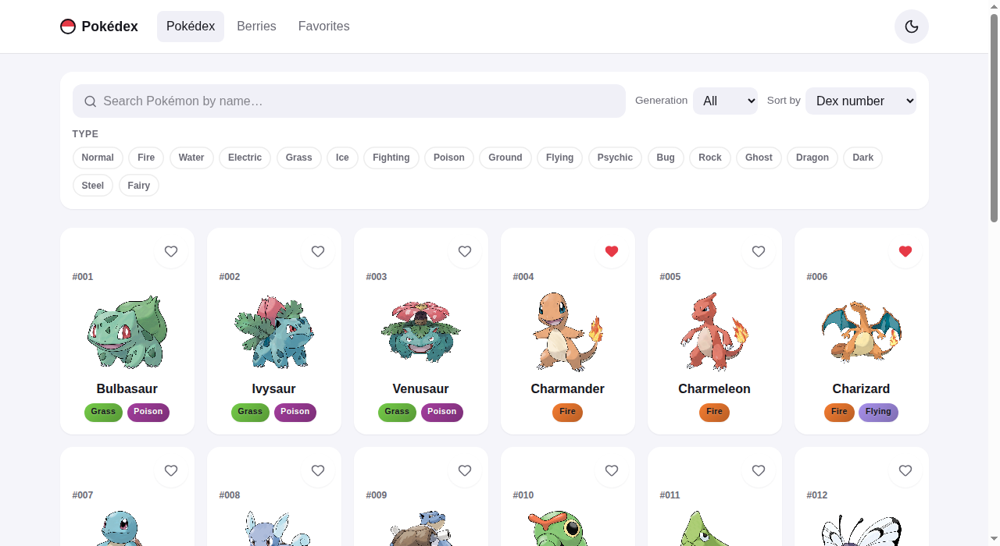
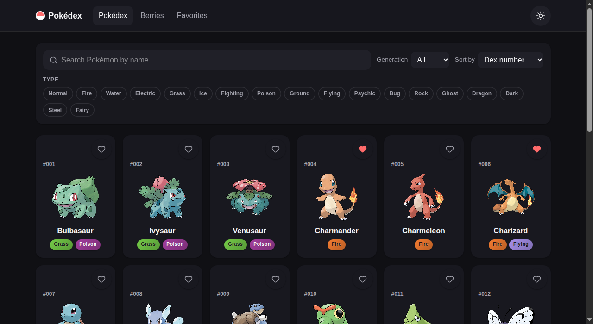
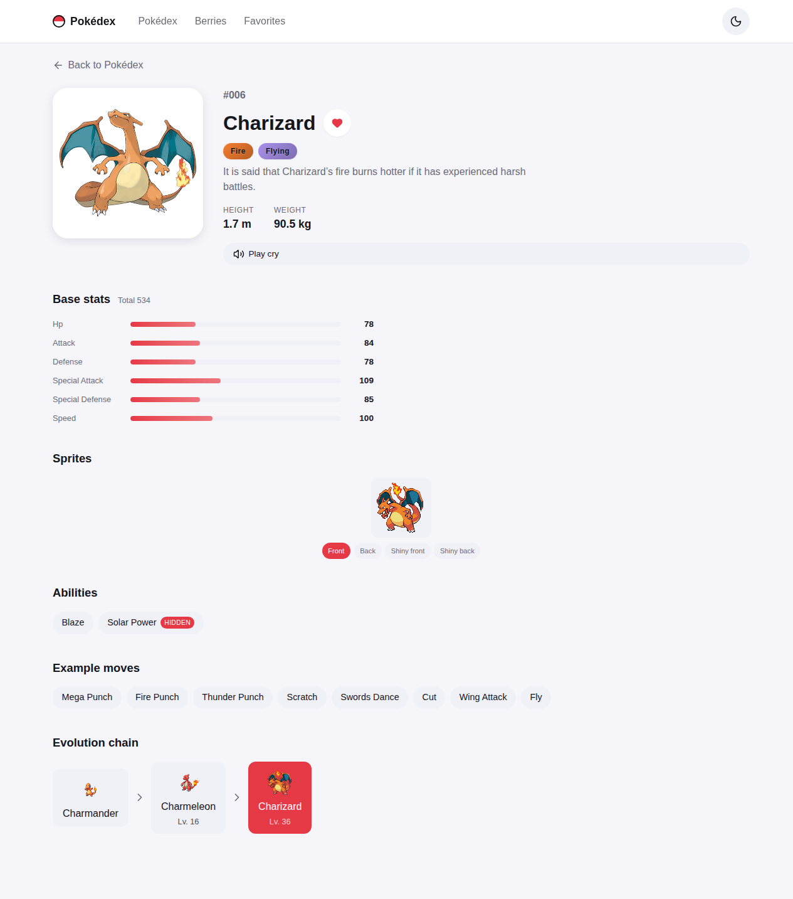
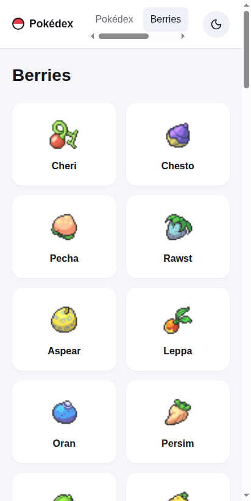
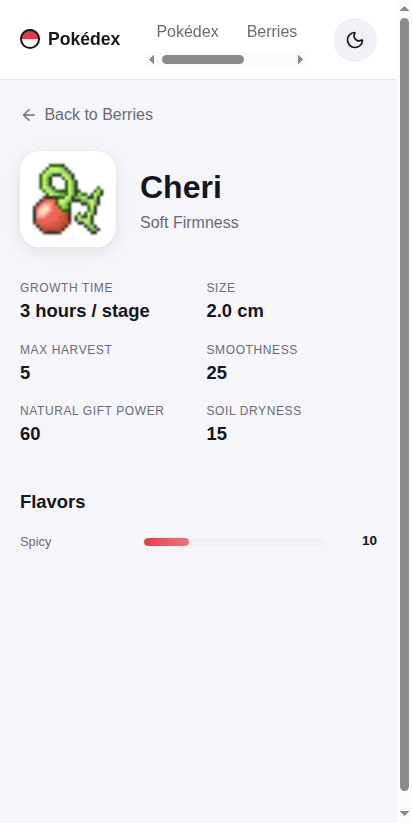
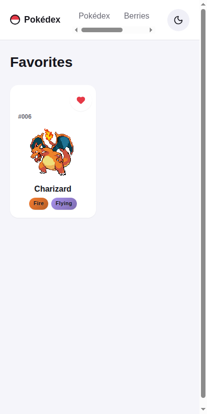
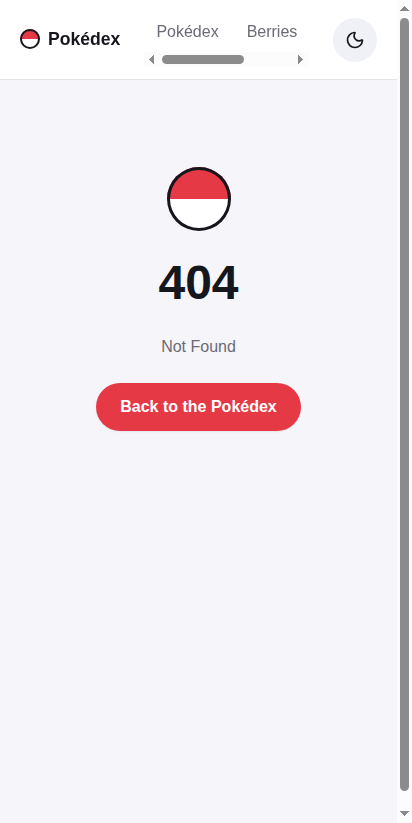

<div align="center">

# 🔴 Pokédex

A fast, animated, fully-accessible Pokédex — built with Svelte 5 and shipped as a static SPA to GitHub Pages.

[](https://github.com/AZagatti/pokedex-s5hi-opusadv/actions/workflows/deploy.yml) [](https://azagatti.github.io/pokedex-s5hi-opusadv/) [](https://svelte.dev) [](https://www.typescriptlang.org/)

**[▶ Live demo](https://azagatti.github.io/pokedex-s5hi-opusadv/)**

</div>



## Lighthouse

Audited on the live deployed URL (mobile, real network):

| Route             | Performance | Accessibility | Best Practices | SEO |
| ----------------- | :---------: | :-----------: | :------------: | :-: |
| `/`               |     100     |      100      |      100       | 100 |
| `/berries`        |     100     |      100      |      100       | 100 |
| `/pokemon/[name]` |    n/a¹     |      100      |      100       | 100 |

¹ Dynamic routes are served via the SPA `404.html` fallback on GitHub Pages (a real 404 status by design — see [`docs/DECISIONS.md`](docs/DECISIONS.md)), which Lighthouse's navigation audit can't score. Verified instead via a client-navigation performance trace: INP 22ms, CLS 0.00.

## Features

- **Pokédex list** — responsive card grid for all 1300+ Pokémon, infinite scroll, skeleton loading states, and a subtle hover/tap lift on every card.
- **Search & filters** — debounced name search, generation filter (I–IX), multi-select type filter (18 types), sort by dex number or base-stat total, with a one-click "clear filters."
- **Detail pages** — animated entrance, official artwork, animated stat bars, type badges, abilities (with a hidden-ability tag), example moves, a recursively-rendered evolution chain, a front/back/shiny sprite switcher, and a cry-playback button.
- **Berries** — a matching list + detail view (firmness, flavors, growth time, size).
- **Favorites** — heart any Pokémon from a card or its detail page; favorites persist to `localStorage` and show up on their own page.
- **Theme** — dark/light toggle, persisted, with no flash-of-unstyled-theme on load.
- **Accessibility** — labeled controls, visible focus states, full keyboard support (including a roving-tabindex sprite switcher), `prefers-reduced-motion` respected everywhere, and a WCAG-contrast-checked palette.
- **404 page** — a proper not-found route, reachable even from a hard reload on a deep link.

## Tech stack

| Layer | Choice |
| --- | --- |
| Framework | [SvelteKit](https://svelte.dev/docs/kit) (Svelte 5 runes) + TypeScript (strict) |
| Deployment | [`@sveltejs/adapter-static`](https://svelte.dev/docs/kit/adapter-static) — SPA mode on GitHub Pages |
| Styling | [Tailwind CSS v4](https://tailwindcss.com/) for layout/utilities, hand-written CSS for animation |
| Icons | [lucide-svelte](https://lucide.dev/) |
| Data | Native `fetch`, an in-memory dedup/cache layer, and [Zod](https://zod.dev/) schemas for every [PokeAPI](https://pokeapi.co/) shape consumed |
| State | Svelte 5 runes + class-based stores, persisted to `localStorage` (favorites, theme) |
| Testing | [Vitest](https://vitest.dev/) (unit) + [Playwright](https://playwright.dev/) (e2e) |
| Quality | [`ultracite`](https://github.com/haydenbleasel/ultracite) wired to `oxlint` + `oxfmt`, [`lefthook`](https://github.com/evilmartians/lefthook) git hooks |
| CI/CD | GitHub Actions → GitHub Pages |

See [`docs/ARCHITECTURE.md`](docs/ARCHITECTURE.md) for how the pieces fit together, and [`docs/DECISIONS.md`](docs/DECISIONS.md) for the reasoning behind each pinned choice (including the two deliberate deviations from a "pure CSR" model).

## Screenshots

| List (light) | List (dark) | Detail |
| :-: | :-: | :-: |
|  |  |  |

| Berries | Berry detail | Favorites |
| :-: | :-: | :-: |
|  |  |  |

<details>
<summary>404 page</summary>



</details>

## Running locally

Requires Node 24+.

```bash
npm install
npm run dev          # http://localhost:5173
```

Other scripts:

```bash
npm run build         # production build (base path '', servable by `npm run preview`)
npm run preview        # serve the production build
npm run check         # svelte-check (typecheck)
npm run lint           # oxlint
npm run format         # oxlint/oxfmt --fix
npm run test:unit       # vitest
npm run test:e2e       # Playwright e2e (builds + previews the app first)
npm run test           # unit + e2e
```

`lefthook` runs lint + typecheck on every commit and the full test suite before every push (`npx lefthook install` if hooks aren't active after a fresh clone).

### Verifying the GitHub Pages base path locally

The deploy build is served under `/pokedex-s5hi-opusadv/`, which a plain `vite preview` doesn't reproduce. `scripts/pages-emulate.mjs` does:

```bash
BASE_PATH=/pokedex-s5hi-opusadv npm run build
node scripts/pages-emulate.mjs   # http://127.0.0.1:4174/pokedex-s5hi-opusadv/
```

## Deployment

Pushing to `main` runs the full quality gate (lint, typecheck, unit + e2e tests) and, if it passes, builds with `BASE_PATH=/pokedex-s5hi-opusadv` and deploys the static output to GitHub Pages via `actions/deploy-pages`. See [`.github/workflows/deploy.yml`](.github/workflows/deploy.yml).
